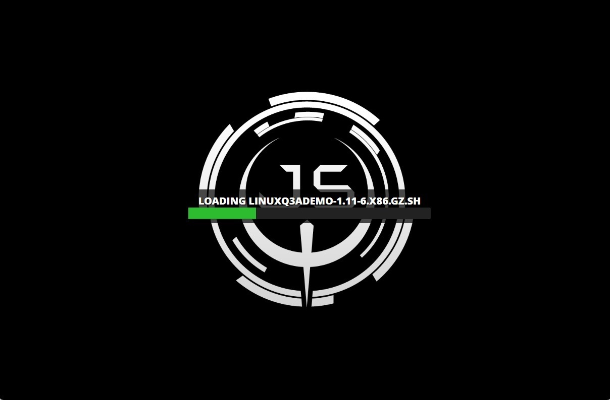
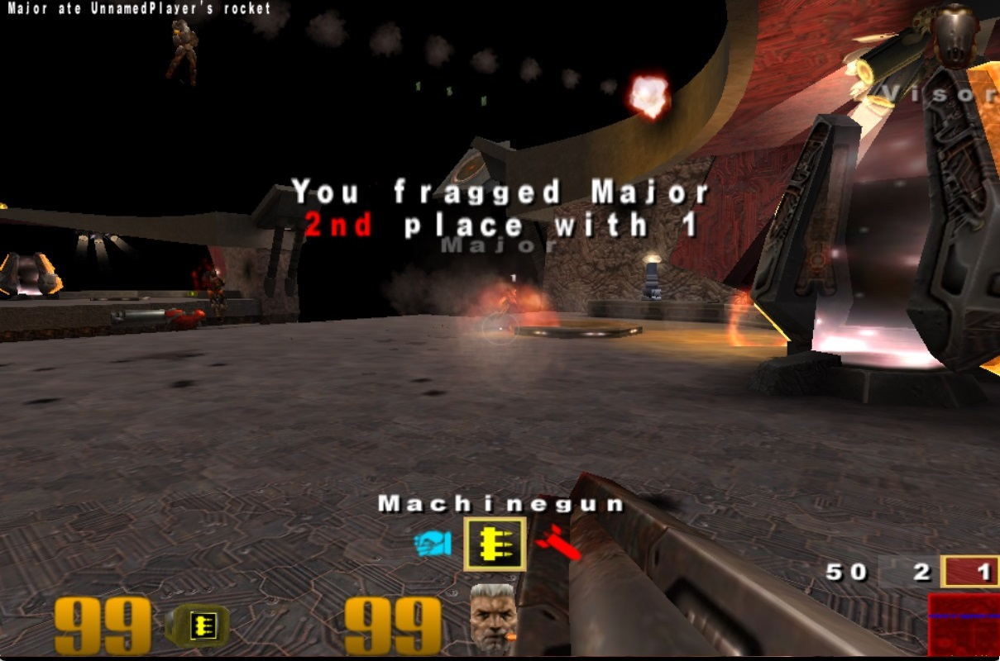

# quake-formation
This project explores the deployment of a fully functional [Quake III Arena](https://en.wikipedia.org/wiki/Quake_III_Arena) server to the [AWS](https://aws.amazon.com/) ecosystem using [CloudFormation](https://aws.amazon.com/cloudformation/).


## What?
The deployed app will serve clients an experience that closely mirrors the original Quake III Arena desktop application entirely in-browser.


## Why?
Nostalgia, obviously.

But more importantly, the [containerized version of Quake being deployed here](https://github.com/treyyoder/quakejs-docker) embodies the complexities of modern software architectures. 
Think of this as an [AWS IaC](https://aws.amazon.com/what-is/iac/) "Hello, World!".

## Architecture
On the backend there's a containerized [Node](https://nodejs.org/en) server for dynamic content, [Apache2](https://httpd.apache.org/) to serve static assets, and an [Nginx](https://www.nginx.com/) reverse proxy providing HTTPS. 
On the frontend, the stack serves clients an experience that closely mirrors the original Quake III Arena desktop application entirely in-browser.
Both the frontend and backend run [JavaScript](https://www.javascript.com/) and [WebAssembly](https://webassembly.org/) 
compiled from the [Quake codebase](https://github.com/id-Software/Quake) using [emscripten](https://emscripten.org/).

The containerized components in this architecture are orchestrated by an [EKS](https://aws.amazon.com/eks/) [Kubernetes](https://kubernetes.io/) control plane that manages an [EC2](https://aws.amazon.com/ec2/) nodegroup and deployed using CloudFormation.
Access to the deployed app is ultimately achieved via an [Elastic Load Balancer](https://aws.amazon.com/elasticloadbalancing/) URL.


## Structure of this repository
By design this is a flat and simple repository.

[/scripts](./scripts)
* ```kube-stack.yml``` is an AWS CloudFormation template for standing up an EKS with several EC2 worker nodes.
* ```quakejs.yml``` defines various Kubernetes resources needed to deploy a containerized Quake III Arena server fronted by nginx.
* ```config.sh``` contains various configuration parameters
* ```create-stack.sh``` is used to create the EKS stack
* ```deploy-quakejs.sh``` is used to deploy quake to the EKS stack
* ```undeploy-quakejs.sh``` is used to remove quake from the EKS stack
* ```uncreate-stack.sh``` is used to tear down the EKS stack


## Prerequsites
You'll need to [configure your aws cli](https://docs.aws.amazon.com/cli/latest/userguide/cli-chap-configure.html) before running any of the commands below.


## 1. Create the stack
You'll want to begin by creating a CloudFormation stack via ```./create-stack.sh``` which should produce output like:

```
...
Creating stack [quakejs-stack]. This may take several minutes...
{
    "StackId": "arn:aws:cloudformation:us-east-1:344771117094:stack/quakejs-stack/ffeea233-113b-264b-23ee-372615789390"
}
Deploy complete.
done.
```


## 2. Deploy the app
Deploy the QuakeJS application to your EKS via ```./deploy-quakejs.sh``` which should produce output like:

```
...
Waiting for quakejs deployment to become available...
deployment.apps/quakejs-scenario-deployment condition met
NAME                  EXTERNAL-IP
quakejs-loadbalancer  1234567asdfasfdasfdasfdasfdasfdasdfasfdasd.us-east-1.elb.amazonaws.com
You can reach your quake deployment @ https://1234567asdfasfdasfdasfdasfdasfdasdfasfdasd.us-east-1.elb.amazonaws.com:31337
NOTE: it may take a few minutes for this endpoint to resolve
```


## 3. Access the server
The deploy command above will return the load balancer URL you should use to access the endpoint:
```
You can reach your quake deployment @ https://1234567asdfasfdasfdasfdasfdasfdasdfasfdasd.us-east-1.elb.amazonaws.com:31337
```

Note that it may take a minute or two for the URL to resolve. 
Once it does, you'll see some prompts about security (the server uses a self-signed x509 certificate) and after agreeing to the EULA and 
downloading several assets your browser's game client will connect to the server and off you go.






## 4. Uncreate the stack
All good things must come to an end. 

Tear down the stack via ```./uncreate-stack.sh``` which should produce something like:
```
./uncreate-stack.sh
Stack [quakejs-stack] already exists.
Do you want to delete stack [quakejs-stack] (this may take a long time)? (yY/nN): y
namespace "quakejs-proxy-ns" deleted
namespace "quakejs-quakeserver-ns" deleted
service "quakejs-loadbalancer" deleted
service "quakejs-service" deleted
configmap "quakejs-nginx-configmap" deleted
configmap "quakejs-server-config" deleted
deployment.apps "quakejs-scenario-deployment" deleted
deployment.apps "nginx-entrypoint-deployment" deleted
Cleaning up existing stack named [quakejs-stack]. This may take several minutes...
```


## License
[Apache 2.0](https://www.apache.org/licenses/LICENSE-2.0.txt)


## Credits

* [criticalstack](https://github.com/criticalstack/quake-kube) did a Kubernetes POC for Quake III Arena
* [treyyoder](https://github.com/treyyoder/quakejs-docker) authored the image used in this example

## END